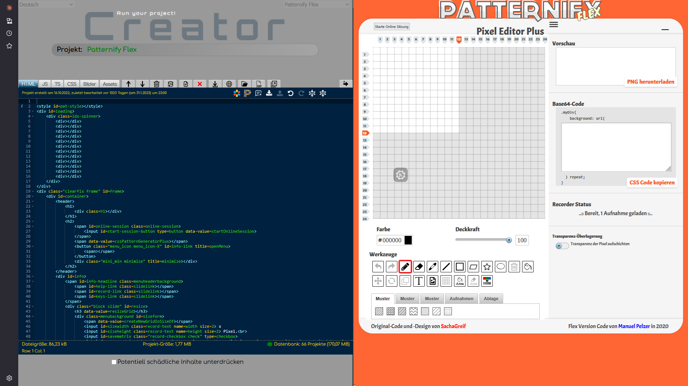

# Creator

A powerful playground for HTML, CSS, JavaScript, and TypeScript with live preview and persistent storage.

## 🚀 Features

- **Multi-Language Support**: Work with HTML, CSS, JavaScript, and TypeScript in dedicated editors
- **Live Preview**: See your changes in real-time
- **Persistent Storage**: Projects are automatically saved in your browser's IndexedDB
- **Advanced Code Editing**: Powered by Cloud9's Ace Editor with:
  - Syntax highlighting
  - Syntax checking
  - Code beautifier
  - Code minifier
  - Undo/Redo functionality
  - Intelligent code completion
- **Asset Management**: 
  - Image upload with automatic dataURI conversion
  - Asset editor for embedding various file types
  - Global `_assets_` constant for runtime access
- **Project Management**:
  - Export projects as ZIP, JSON, or HTML
  - Import projects from ZIP files
  - Quick project switching via dropdown or context menu
  - Bulk project management
- **Localization**: Available in English and German

## Screenshot

In the example screenshot the project `Patternify Flex` is loaded.

---

## 📋 Getting Started

### Basic Usage

1. Open `index.html` in your browser
2. Create a new project and give it a name
3. Start coding in any of the six editors (HTML, JavaScript, TypeScript, CSS, Images, Assets)
4. Your project is automatically saved to IndexedDB
5. The most recently used project opens automatically on restart

### Database-Free Mode

To run Creator without IndexedDB (useful for portable setups):

1. Export your projects as a ZIP file
2. Extract the ZIP contents to the `/creations` subfolder
3. Open the tool with `index.html?usedb=0`
4. Projects will be loaded from the `/json` folder

**Note**
- Auto-save is disabled in database-free mode.
- You can put the ZIP file right into the `/creations` subfolder, just unzip the file **creationlist.txt** from it 
into the same `/creations` folder. Creator unzips all projects by itself, if it finds the **creationslist.txt**.

## 🎨 Editors Overview

### HTML, CSS, JavaScript, TypeScript Editors
Standard code editors with full syntax support, validation, and formatting capabilities.

### Images Editor
- Upload images via the 'Upload' button
- Images are automatically converted to dataURIs
- During project rendering, all image paths in HTML/CSS are replaced with dataURIs
- **Caution**: Manual editing not recommended unless you know what you're doing

### Assets Editor
- Upload files and choose processing method:
  - **By Extension**: Standard file type handling
  - **As Asset**: Advanced conversion to dataURI, minified text, or binary array buffer
- Assets are stored as JSON
- Access via global `_assets_` constant in your JavaScript code
- **Caution**: Manual editing not recommended unless you know what you're doing

## 📦 Import/Export

### Export Options
- **Single Project as JSON**: Portable project file
- **Single Project as HTML**: Standalone HTML file
- **All Projects as ZIP**: Complete backup of all projects

### Import Options
- **Load from Filesystem**: Click the import tab above the editor to choose a zip or json file to import.

## 🎮 Sample Projects
Creator includes five demonstration projects to help you get started:
1. **CleanCSS**: CSS cleaning and optimization tool
2. **Game Of Life**: Conway's Game of Life implementation
3. **JS Fuck**: JavaScript obfuscation example
4. **JS Fuck Decoder**: Decoder for JS Fuck obfuscated code
5. **Patternify Flex**: CSS pattern generator (custom Flex version of Patternify.com)
   - Try `Shift + F11` for a demo
   - **Note**: May contain minor bugs

## 🛠️ Technical Details
- **TypeScript Transpiler**: Is automatically applied, if there is any content inside the ts editor.
- **Editor Engine**: Cloud9 Ace Editor
- **Minifier**
  - HTML: HTML-Minifier-Terser
  - JS + TS: Terser
  - CSS: CleanCSS
- **Beautifier**: Beautifier (for HTML, CSS, and JS)
- **Console**: Eruda
- **Database**: IndexedDB (browser-native)
- **Architecture**: Six independent editors, tab-based switching
- **Asset Handling**: Automatic conversion to dataURIs, minified text, or binary arrays
- **Auto reload**: Reloads the project on editor content change (with a delay of 1s).
- **Localization**: By default english and german are available, but you can create any language. 
  Use the drop down menu in the top left corner and choose `[Customize]`. A newly added language will 
  be stored in browsers localStorage and is automatically applied on startup.

## 🌐 Project Selection

Access your projects via:
- Dropdown menu in the interface
- Right-click context menu → Select Project
- Automatic loading of most recent project on startup

## ⚠️ Important Notes

- Dynamic content loaded at runtime won't automatically use embedded dataURIs
- The Images and Assets editors store data in JSON format
- Manual editing of Images/Assets editors can break projects (use undo if needed)
- Patternify Flex is powerful, but has known minor bugs - use at your own risk.

## 📝 License
License MIT

## 👤 Author
ManuelPeh
